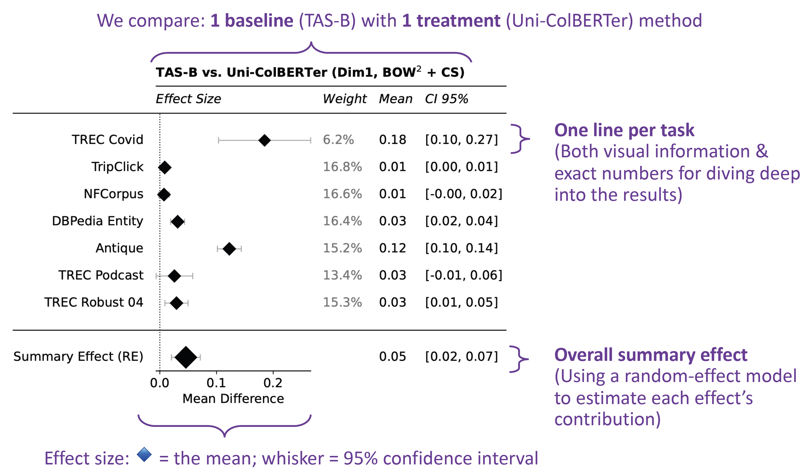

# Welcome to Ranger 🌲
We introduce *Ranger* - a toolkit to facilitate the easy use of effect-size-based meta-analysis for multi-task evaluation in NLP and IR. We observed that our communities often face the challenge of aggregating results over incomparable metrics and scenarios, which makes conclusions and take-away messages less reliable. With *Ranger*, we aim to address this issue by providing a task-agnostic toolkit that combines the effect of a treatment on multiple tasks into one statistical evaluation, allowing for comparison of metrics and computation of an overall summary effect.
Our toolkit produces publication-ready forest plots that enable clear communication of evaluation results over multiple tasks. With the ready-to-use *Ranger* toolkit it is our goal to promote robust, effect-size based evaluation and improve evaluation standards in the community.

*Created by: Mete Sertkan, Sophia Althammer, and Sebastian Hofsätter*

## Features

- 𝚫 **Supports three different effect indices for paired settings**:
    - Raw Mean Difference
    - Standardized Mean Difference
    - Correlation
- 🔎 **Analyzes and combines effects of multiple tasks:**
    - Combines observed effects in each task by employing random-effects-model
    - Provides weights, confidence intervals, and p-values for each task and the summary effect
- 🌲 **Produces publication ready forest plots:**
    - Summarizes the insights of the meta-analysis at one glance
    - Based on matplotlib → Easy to adapt & customize

## Example
We provide two easy-to-run jupyter notebooks for common IR and NLP settings in the  ``/examples`` folder, which highlight *Ranger*'s benefits. However, the figure below shows an example outcome, with explanations highlighting the output of *Ranger* for a multi-task meta-analysis comparing a control and a treatment method:



Effect sizes and corresponding confidence intervals are depicted as diamonds with whiskers ⊢♦⊣. The size of the diamonds is scaled by the experiments’ weights. The dotted vertical line ... at zero represents the zero effect. The observed effect size is not significant when its confidence interval crosses the zero effect line; in other words, we cannot detect the effect size at the given confidence level.


## Installation


```
pip install git+https://github.com/MeteSertkan/ranger.git
```

*(To run the notebooks you also need [jupyter notebooks|lab](https://jupyter.org))*

---
The name ranger is heavily inspired by [Parks & Rec.](https://www.youtube.com/watch?v=XkhMw2KIp_4) 💚
